# Security Guard & Contract Expiry Feature - Architecture & Data Flows

## Component Interaction Diagram

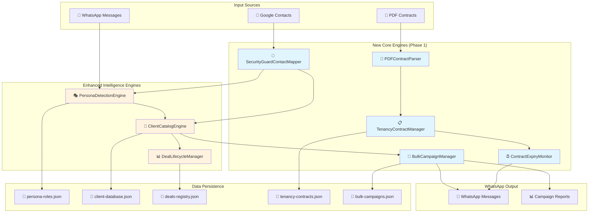

---

## Security Guard Detection Flow

```mermaid
graph LR
    A["👥 Google Contacts"]
    B["🔐 SecurityGuardContactMapper"]
    C["Check Company = D2 Security"]
    D["Extract: location, phone, etc"]
    E["🎭 PersonaDetectionEngine"]
    F["Create/Update Persona"]
    G["📇 ClientCatalogEngine"]
    H["Add/Update Security Guard"]
    I["👨‍💼 Security Guard Profile"]

    A -->|Full Contact Data| B
    B --> C
    C -->|Match Found| D
    D -->|Mapped Data| E
    E -->|detectSecurityGuardFromGoogleContacts| F
    F -->|phone, location, company| G
    G -->|addSecurityGuard()| H
    H --> I

    style B fill:#c8e6c9
    style E fill:#c8e6c9
    style G fill:#c8e6c9
    style I fill:#a5d6a7
```

---

## Contract Expiry Monitoring Flow

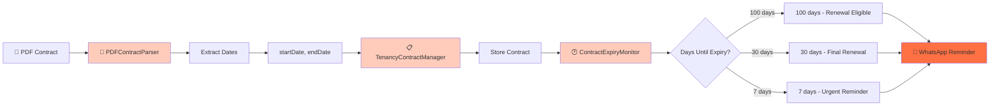

---

## Bulk Campaign Flow

```mermaid
graph LR
    A["📇 ClientCatalogEngine"]
    B["getAllSecurityGuards()"]
    C["List of All Guards"]
    D["📢 BulkCampaignManager"]
    E["createCampaign()"]
    F["Filter Criteria"]
    G["Filters: location, company, shift, time"]
    H["Get Target Guards"]
    I["Execute Campaign"]
    J["scheduledMessage at preferred time"]
    K["💬 WhatsApp"]
    L["📊 Track Engagement"]

    A --> B
    B --> C
    C --> D
    D --> E
    E --> F
    F --> G
    G --> H
    H --> I
    I --> J
    J --> K
    K --> L

    style D fill:#b39ddb
    style E fill:#b39ddb
    style K fill:#ce93d8
    style L fill:#ba68c8
```

---

## Data Model: Security Guard Client

```mermaid
graph TB
    A["Security Guard Client"]
    B["Basic Info"]
    C["Google Contacts Data"]
    D["Profile Data"]
    E["Campaign Tracking"]

    A --> B
    A --> C
    A --> D
    A --> E

    B --> B1["id: string"]
    B --> B2["phone: string"]
    B --> B3["name: string"]
    B --> B4["type: 'security_guard'"]

    C --> C1["contactId: string"]
    C --> C2["email: string"]
    C --> C3["address: string"]

    D --> D1["location: string"]
    D --> D2["company: string"]
    D --> D3["companyId: string"]
    D --> D4["shift: day|night|weekend"]
    D --> D5["yearsOfExperience: number"]

    E --> E1["bulkCampaignsMembership: []"]
    E --> E2["preferredNotificationTimes: []"]
    E --> E3["communicationPreferences: []"]
    E --> E4["optedIn: boolean"]

    style A fill:#a5d6a7
    style B fill:#c8e6c9
    style C fill:#c8e6c9
    style D fill:#c8e6c9
    style E fill:#c8e6c9
```

---

## Data Model: Deal Contract Metadata

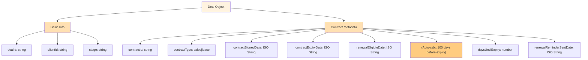

---

## Method Interaction Matrix

```mermaid
graph TB
    subgraph "PersonaDetectionEngine"
        P1["detectPersona(msg, phone)"]
        P2["detectSecurityGuardFromGoogleContacts(phone, contacts)"]
        P3["setPersonaRole(phone, role, details)"]
    end

    subgraph "SecurityGuardContactMapper"
        S1["identifySecurityGuardByPhone(phone, contacts)"]
        S2["getAllSecurityGuards(contacts)"]
        S3["getSecurityGuardsByCompany(company, contacts)"]
        S4["getSecurityGuardsByLocation(location, contacts)"]
    end

    subgraph "ClientCatalogEngine"
        C1["addSecurityGuard(phone, details)"]
        C2["getAllSecurityGuards()"]
        C3["getClientByPhone(phone)"]
    end

    subgraph "TenancyContractManager"
        T1["importContract(contractData)"]
        T2["getContractById(id)"]
        T3["getContractsByTenant(phone)"]
        T4["getContractsExpiringIn(days)"]
    end

    subgraph "ContractExpiryMonitor"
        E1["initialize()"]
        E2["checkContractExpiry()"]
        E3["generateReminderMessage(contract, days)"]
        E4["getContractsNeedingReminder()"]
    end

    subgraph "BulkCampaignManager"
        B1["createCampaign(campaignData)"]
        B2["getTargetGuards(filters)"]
        B3["executeCampaign(campaignId)"]
        B4["trackEngagement(campaignId, phone, action)"]
    end

    subgraph "DealLifecycleManager"
        D1["createDeal(clientId, propertyId)"]
        D2["progressDealStage(dealId, stage)"]
        D3["updateContractExpiry(dealId, metadata)"]
    end

    P2 --> S1
    C1 --> P3
    T1 --> T2
    E2 --> T4
    B2 --> C2
    D3 --> T4

    style P1 fill:#fff3e0
    style P2 fill:#c8e6c9
    style C1 fill:#c8e6c9
    style T1 fill:#ffccbc
    style E2 fill:#ffccbc
    style B3 fill:#b39ddb
    style D3 fill:#fff3e0
```

---

## Integration Points - How Phase 2 Will Connect

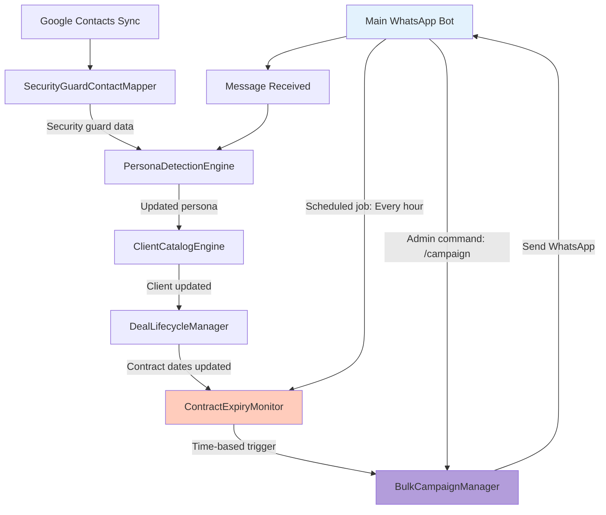

---

## Error Handling & Recovery

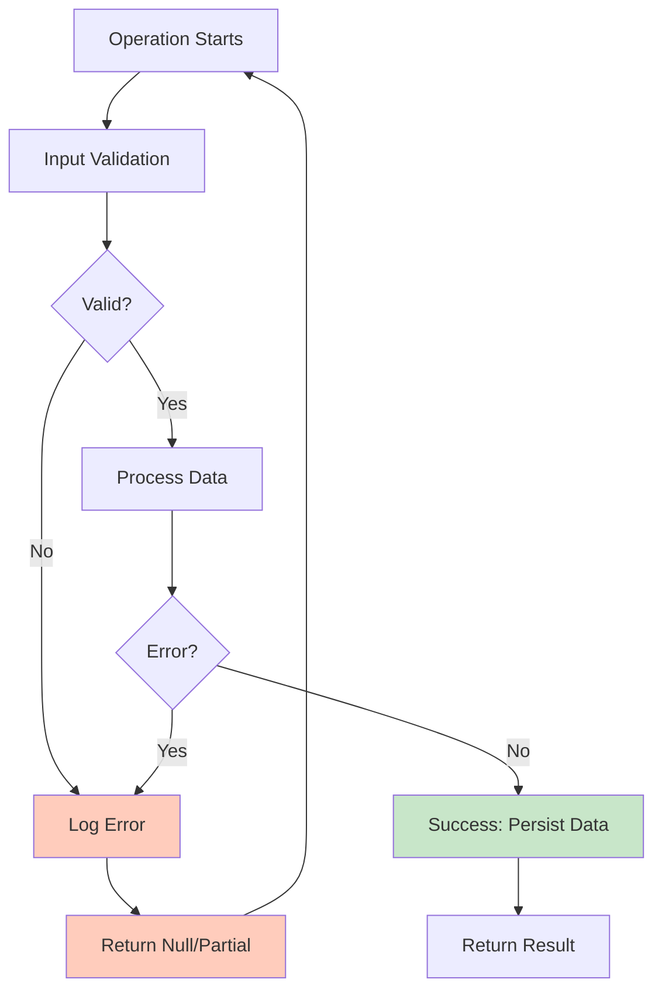

---

## Data Persistence Strategy

```mermaid
graph LR
    A["In-Memory Maps"]
    B["Data Change"]
    C["Async Write to JSON"]
    D["File System"]

    A -->|detectPersona()| B
    A -->|setPersonaRole()| B
    A -->|addSecurityGuard()| B
    A -->|importContract()| B
    A -->|createCampaign()| B
    A -->|executeCampaign()| B

    B --> C
    C --> D

    D -->|On Startup| A

    style A fill:#b3e5fc
    style C fill:#ffe0b2
    style D fill:#c8e6c9
```

---

## File Organization & Data Flow

```
code/
├── Intelligence/
│   ├── PersonaDetectionEngine.js
│   │   ├── detectPersona(msg, phone)
│   │   └── detectSecurityGuardFromGoogleContacts(phone, contacts)  ← NEW
│   │
│   ├── ClientCatalogEngine.js
│   │   ├── addBuyer/addTenant/addSecurityGuard()  ← addSecurityGuard NEW
│   │   └── getAllSecurityGuards()  ← NEW
│   │
│   ├── DealLifecycleManager.js
│   │   ├── createDeal()
│   │   ├── progressDealStage()
│   │   └── updateContractExpiry()  ← NEW
│   │
│   ├── SecurityGuardContactMapper.js  ← NEW FILE
│   │   ├── identifySecurityGuardByPhone()
│   │   ├── getAllSecurityGuards()
│   │   ├── getSecurityGuardsByCompany()
│   │   └── getSecurityGuardsByLocation()
│   │
│   └── TenancyContractManager.js  ← NEW FILE
│       ├── importContract()
│       ├── getContractById()
│       ├── getContractsByTenant()
│       └── getContractsExpiringIn()
│
├── Services/
│   ├── PDFContractParser.js  ← NEW FILE
│   │   ├── parseContractPDF(pdfPath)
│   │   ├── extractCompanyData(company)
│   │   └── validateContractDates(contract)
│   │
│   ├── ContractExpiryMonitor.js  ← NEW FILE
│   │   ├── initialize()
│   │   ├── checkContractExpiry()
│   │   ├── generateReminderMessage()
│   │   └── getContractsNeedingReminder()
│   │
│   └── BulkCampaignManager.js  ← NEW FILE
│       ├── createCampaign()
│       ├── getTargetGuards()
│       ├── executeCampaign()
│       └── trackEngagement()
│
└── Data/
    ├── persona-roles.json
    ├── client-database.json
    ├── deals-registry.json
    ├── tenancy-contracts.json  ← NEW PERSISTENCE
    └── bulk-campaigns.json  ← NEW PERSISTENCE
```

---

## Technology Stack

| Component | Technology | Purpose |
|-----------|-----------|---------|
| **PDF Parsing** | pdf-parse npm | Extract contract dates |
| **Google Contacts** | Google Contacts API | Identify security guards |
| **WhatsApp** | whatsapp-web.js | Send messages & campaigns |
| **Data Storage** | JSON files (./code/Data/) | Persistent data |
| **Logging** | logger utility | Operation tracking |
| **Date Handling** | Native JavaScript Date | Calculate expiry windows |

---

## Security & Privacy Considerations

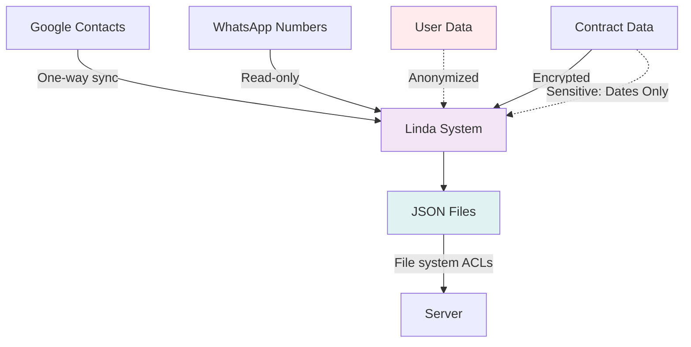

---

## Sequence Diagram: Security Guard Detection

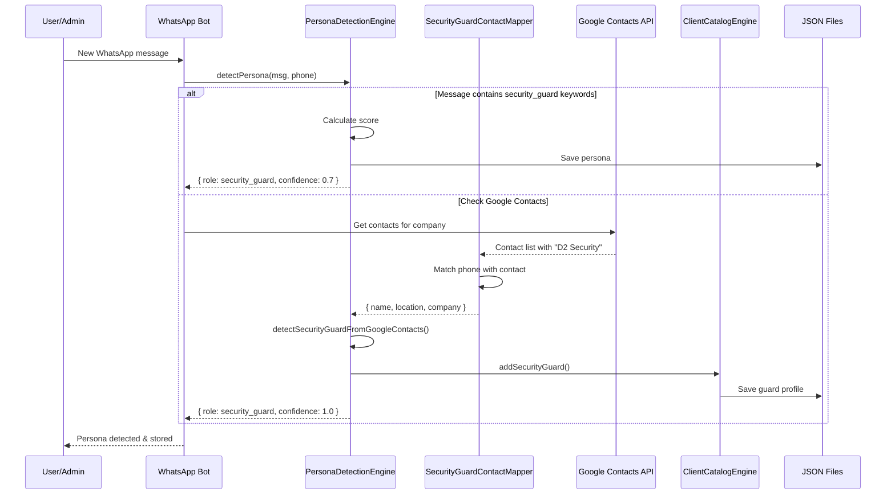

---

## Sequence Diagram: Contract Expiry Reminder

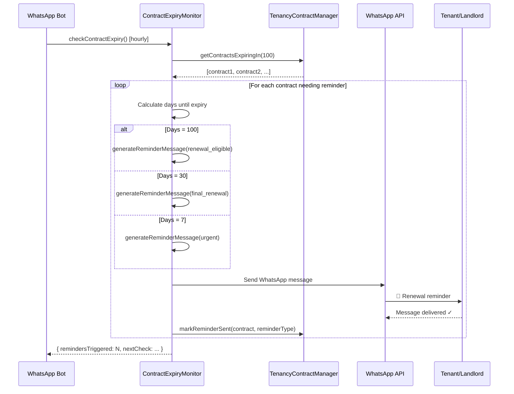

---

**Document Purpose:** Visual reference for system architecture, data flows, and integration points
**Created:** Session 8
**Status:** Phase 1 Complete - Ready for Phase 2 Integration
